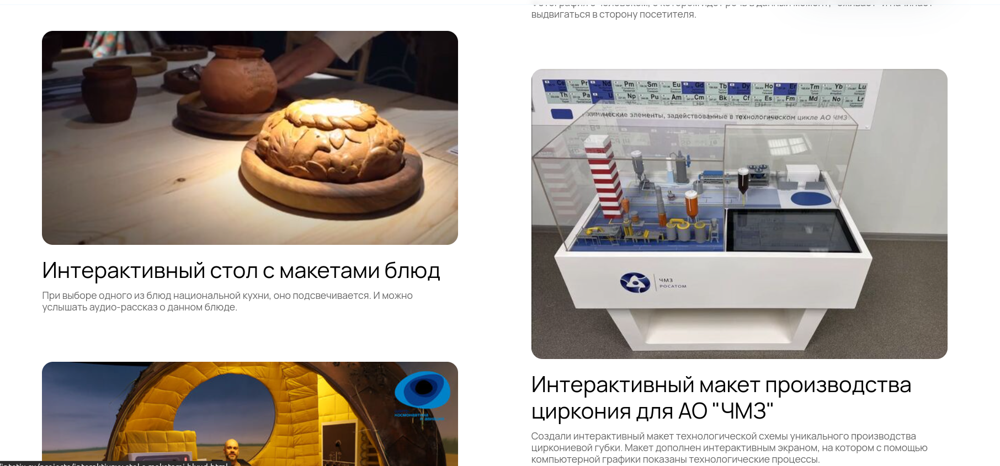
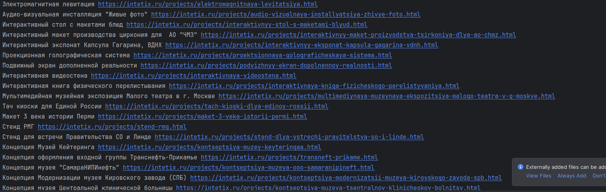
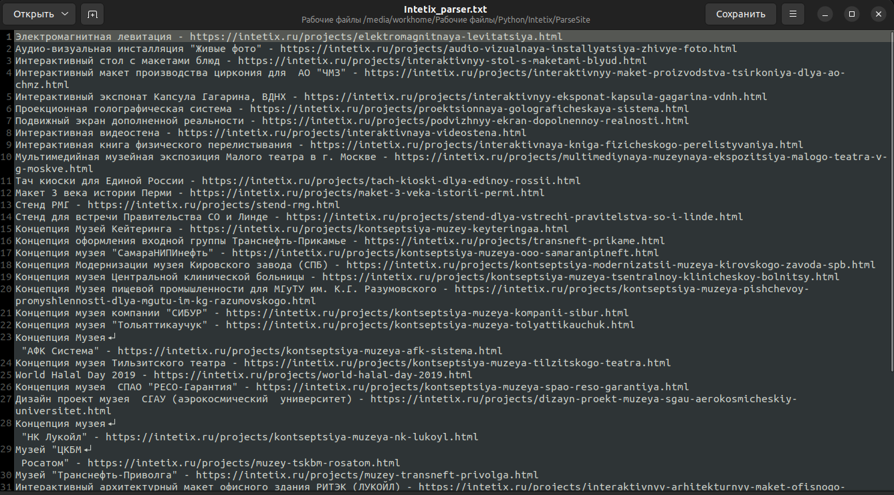

# Parser_Site

<h3>Задача по парсингу сайта</h3>

Нужно было с сайта компании получить названия товара(кейса) и ссылку на него 
для ChatBase, так как данный сервис не работает с сетью и выдавал фейковые ссылки на кейсы.
Теперь можно обучить нейросеть и скормив ему этот файл и ссылки будут приходить валидные.  

 
результат:
 

